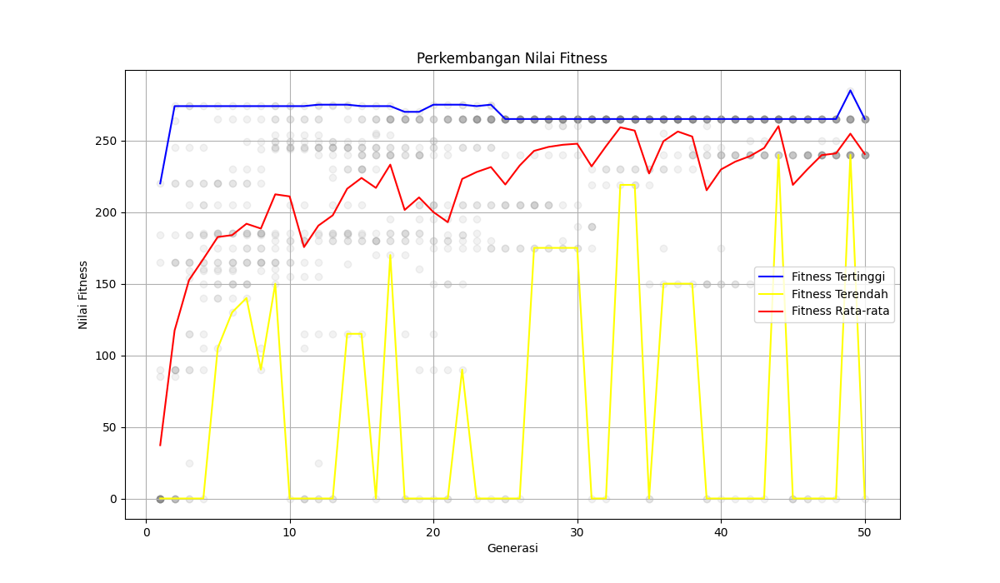

# Algoritma Genetika — Knapsack Problem

> **Praktikum Kecerdasan Buatan — Pertemuan 9**
> Implementasi Algoritma Genetika (Genetic Algorithm) untuk menyelesaikan masalah _0/1 Knapsack Problem_.

---

## Deskripsi

Algoritma Genetika (GA) adalah metode pencarian heuristik yang terinspirasi dari proses seleksi alam dan evolusi biologis. GA menggunakan mekanisme seperti seleksi, persilangan (_crossover_), dan mutasi untuk menghasilkan solusi yang semakin baik dari generasi ke generasi.

Pada praktikum ini, GA diterapkan untuk memecahkan **0/1 Knapsack Problem**, yaitu masalah optimasi kombinatorial yang bertujuan **memaksimalkan total nilai barang** yang dimasukkan ke dalam tas, dengan batasan **total berat tidak melebihi kapasitas maksimum**.

---

## Struktur File

```
Pertemuan9/
├── InisiasiPopulasi.py   # Inisialisasi populasi secara acak
├── EvaluasiFitness.py    # Fungsi evaluasi fitness (nilai knapsack)
├── selection.py          # Operator seleksi (Roulette Wheel & Tournament)
├── crossover.py          # Operator crossover (One-Point, Two-Point, Uniform)
├── mutation.py           # Operator mutasi (Swap, Inversion, Uniform)
├── main.py               # Program utama — loop GA lengkap
├── fitness_history.png   # Grafik hasil eksperimen
└── README.md             # Dokumentasi proyek
```

---

## Data Item (Knapsack)

| No  | Item     | Nilai | Berat |
| --- | -------- | ----- | ----- |
| 1   | Barang 1 | 60    | 10    |
| 2   | Barang 2 | 100   | 20    |
| 3   | Barang 3 | 120   | 30    |
| 4   | Barang 4 | 90    | 25    |
| 5   | Barang 5 | 69    | 11    |
| 6   | Barang 6 | 70    | 9     |
| 7   | Barang 7 | 80    | 15    |
| 8   | Barang 8 | 90    | 10    |
| 9   | Barang 9 | 25    | 3     |

**Kapasitas Knapsack:** 50

---

## Hasil Eksperimen

Output terminal terbaik yang didapatkan dari salah satu iterasi:

```
Nilai Fitness Terbaik: 334
Total Bobot: 48
Barang Terpilih:
- Barang 5
- Barang 6
- Barang 7
- Barang 8
- Barang 9
```

**Grafik Perkembangan Nilai Fitness:**



---

## Cara Menjalankan

### Prasyarat

Pastikan Python 3, `matplotlib`, dan `numpy` terinstall:

```bash
pip install matplotlib numpy
```

### Menjalankan Program Utama

```bash
python main.py
```

---

## 👤 Informasi

|                 |                                 |
| --------------- | ------------------------------- |
| **Mata Kuliah** | Praktikum Kecerdasan Buatan     |
| **Pertemuan**   | 9 — Algoritma Genetika          |
| **NIM**         | H1D024034                       |
| **Nama**        | Izazfalih                       |
| **Bahasa**      | Python 3                        |
| **Library**     | `random`, `matplotlib`, `numpy` |
